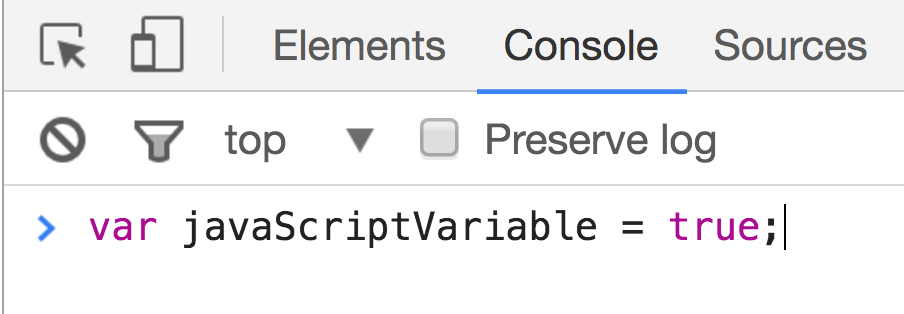

# LEARNING OBJECTIVES

- Describe the role Javascript plays alongside HTML and CSS.
- List and describe the primitive data types.
- Define and use complex data types.
- Practice proper JS syntax and semantic variable naming.
- Describe uses of mathematical operators in Javascript.
- Define type coercion.
- Explain the difference between `prompt` and `console.log`
- Differentiate between `true` & `false` && ***truthy*** & ***falsey***
- Write an if, else if, and else statement in JS
- Describe why control flow is utilized in computer programming
- Write a for loop and while loop in JS and differentiate between them
- Utilize loops to iterate through complex data types

## Framing

We've dabbled with HTML and CSS. There's a bit of interactivity we can program through CSS but not nearly enough! How can we start to add logic, data-handling, and behaviors to our web apps? .. Enter javascript.

# HTML, CSS and Javascript (20 min, 0:20)

HTML, CSS and Javascript are technologies which serve as the basic components of front-end development. Front-end frameworks and libraries that add "layers of abstraction" (the ability to do more with less code) make use of these three technologies.


#### If a web application or website were a building:

##### HTML: Structure and Content
 HTML would be like the most stripped down version of that building, just the structure of the building, the building materials, and some content (maybe unfurnished offices, an empty classroom, a set of not-yet-operational bowling-lanes, etc).

##### CSS: Styling
CSS is responsible for the appearance of the building, adding granite floors, polished doors, wooden railings, etc. CSS styles the content of a website to look like more than just black text on a white background.

##### Javascript: Behavior and Functionality
Javascript might be like the building's elevator systems, ID-scanning & entry systems. Javascript handles interactivity and data.


## Think-Pair-Share: Identify Javascript features in Cookie Clicker.
* 2 minutes: Go look at [Cookie Clicker](http://orteil.dashnet.org/cookieclicker/) . Play with it. Think about what's allowing these behaviors to exist.
* 3 minutes: Discuss and compare findings in pairs.
* Think about what functionality the site has after it has loaded.
* Why would you say a particular feature is "run" by Javascript instead of, say, CSS?

### Findings

#### Interactivity

  - Javascript defines behavior on a webpage, what happens you interact with it.
  - Data changes in response to user actions
    - Clicking the cookie: increment a cookie total.
    - Like (FB): increment Like counter.
    - Comment (FB): submit comment, appended to post.

#### No Refreshes: User Experience (UX)

  - When I click a cookie, CC is able to increment and update the counter on the page without a hard refresh.
  - When I comment on a post, Facebook is able to process my new comment and render it on the page without refreshing the entire page.
    - Gives the page a much smoother user experience compared to a static page that doesn't have this sort of functionality.
    - Imagine if Cookie Clicker just had an infinite number of static pages, one page for each quantity of cookies (html for 1 cookie, for 2 cookies, for 3 cookies, ... ∞ cookies...)
      - This would be terrible

#### Communication with Servers

  - Javascript is somehow talking to a server
    0. Giving notice that a user has taken a particular action (clicked a cookie, submitted a form, posted a post)
    0. Asking it store some data associated with that interaction with the webpage
    (cookie quantity, form data, contents of a post)
    0. Being told display the results of that user-website interaction (updated cookie quantity, new user account log-in, new post on everyone's feed)

This is not an exhaustive list of Javascript properties, but we'll go over these and more in more detail later on in the course.

So, to sum up the main three components of front-end web development up in one word each (Hint: remember the Building example)
- HTML: Structure
- CSS: Styling
- Javascript: Behavior

# JS: The Client-Side Programming Language of the Web (5 Minutes, 0:25)

- Brief history: Created in 10 days by [Brendan Eich](https://en.wikipedia.org/wiki/Brendan_Eich), of Mozilla. *Not* related to Java in any way but its name.
  - "Java" is to "Javascript" as "ham" is to "hamster"
  - ECMA Script 6 (ES6/2015) vs ES5

- ST-wg: What's a programming language?
  - What can it do that a markup language like HTML can't?
  - It let's us do things! It lets us act on information, manipulate it, display it, pretty much whatever we want.
- Javascript enables us to do all that in a browser.
  - Using the tools you learned in the pre-work (e.g., data types, loops, functions).

## Why is it the dominant programming language of the web?
- Barriers to entry for learning Javascript are very low.
  - No additional software required to run it. Just a text editor and a browser.
    - You can even run it directly in the browser via its Javascript console.
      - Ex. Hide images on the GA website.
      - You'll learn more about the browser Javascript console when you start adding Javascript to the websites you make in this class.
- On top of that, it's supported by all web browsers.
- Javascript has evolved since its creation.
  - One of the biggest additions to JS was AJAX, which allows use to reload parts of a page without refreshing the entire thing (just like on Facebook). Big implications for User Experience.
- A lot of frameworks and libraries -- like Backbone and jQuery -- have emerged that enable us to do so much more -- and do it quickly -- with Javascript.

# Setting up our environment (5 min, 0:30)

We're going to spend the next few minutes learning how to set up our development environment, or our work area for working with Javascript. As far as development environments go, this is about as simple as it gets! If it feels unfamiliar and cumbersome to set up at first, don't worry--speed quickly comes with repetition.

## Steps:
  0. [Create files](#filecreate)
  0. Save changes to file(s)
    - `⌘ S`
  0. [Open files in chrome and open chrome console](#openinchrome)
    - `⌘ TAB` to switch to Chrome, if open
    - If Chrome isn't open, `⌘ [SPACE]` to open Spotlight (Max OS X Finder Speed Search), and then type Chrome and hit enter when the Chrome icon appears

<a name="filecreate"></a>
## First, create your HTML and JS

- `index.html` and `script.js`

```html
<!DOCTYPE html>
<html>
  <head>
    <title>This is the Title</title>
  </head>
  <body>
  <script src="script.js"></script>
  </body>
</html>
```
You can also put your script tag in the head. Putting the tag in the body ensures that the rest of the page loads before your script files run. Also of note, [HTML5 added two attributes ](http://www.growingwiththeweb.com/2014/02/async-vs-defer-attributes.html) that increase control when scripts load and run.


<a name="openinchrome"></a>
## Next, open the site in Chrome, and open the Dev Tools
- Open the javascript console with Command + Option + J (`⌘ + ⌥ + J`)

You should see something like this, but without the example of a javascript expression that declares a variable.


> Example of a javascript expression (a variable declaration, or declaring a variable) in the Chrome Console.


### The REPL

The "Console" is an example of a REPL, which is a tool for testing and debugging code. REPL is an acronym that stands for “**R**ead, **E**valuate, **P**rint, **L**oop”.

Think of the REPL as being simply like scratch-paper for code. It's a small programming environment that lets us run Javascript code one line at a time.

  - What does it do?
    1. (**R**)eads our code.
    2. (**E**)valuates expressions.
    3. (**P**)rints the result to the console, if any (some things result in or ***return*** `undefined`).
    4. Then it (**L**)oops back to the beginning, ready to (**R**)ead the next line of code we feed it. It 'listens' for new code.
  - Primarily used for testing and debugging. It's like scratch paper for coding!

> In Chrome, `⌘ + ⌥ + i` opens the chrome dev tools. Here you can do a bunch of stuff like inspect elements and see html, css and scripts the page has loaded. It allows you to access the console which interacts with the JS that the page has loaded. In our case we'll see that interaction with the code below

In your `script.js` file add the following:
```js
console.log("hello world")
```

> console.log() is just a way to log something in  our REPL.  

# Intro to Javascript Fundamentals

## Your Own Personal JS

This section is structured as guided individual practice. The goal behind this exercise this is to increase *your own personal familiarity* with Javascript, through seeing ***output*** of different, individual javascript ***expressions***.


1. **Clone** down the [data types repo here](https://github.com/ga-wdi-exercises/js-data-types).
2. In atom, open [exercise.md](https://github.com/ga-wdi-exercises/js-data-types/blob/master/exercise.md) to use as the worksheet to work with the following 3 sections:

## We do: Data Types & Data Collections (20 min, 0:50)

Let's talk about what the different data types are in Javascript. Click the link below!

Reference [Data Types And Collections](./data-types-and-collections.md) to complete the above exercise.


## 10 Min Review (10 min, 1:00)

- 5 types of Primitives
- Composite Data Types
- Type Coercion
- Accessing values in arrays and objects

## Break (10 min, 1:10)

## You do: Booleans and Conditionals (15 min, 1:25)

Reference [Booleans and Conditionals](./booleans-and-conditionals.md) to complete the above exercise.

## 10 Min Review (10 min, 1:35)

- Truthy vs Falsey
- Purpose of Control Flow

## You do: [Loops and Fizzbuzz](https://github.com/ga-wdi-exercises/js-data-types/blob/master/exercise.md)(15 min, 1:50)

Reference [Loops](./loops.md) to complete the above exercise.

## 10 Min Review (10 min, 2:00)

- when to use `for` and when to use `while`

# BREAK (10 min, 2:10)

# Syntax & Semantic Naming

## Syntax (5 min, 2:15)

### Semicolons
- General practice is to end every line with a semi-colon, though you may see JS code without any semi-colons.
- Usage depends on the developer.

### camelCase: The Javascript Variable-naming Convention
  - First letter of first word lowercase.
  - First letter of remaining words uppercase.
  - No spaces or punctuation between words.

# camelCase Examples

  ```javascript
  // camelCase
  var pizzaTopping = "pepperoni";

  var isThisVarCamelCase = true;

  //let is similar to var
  let numPatrons = 6;

  //let is similar to var, but you can only assign the value a const once, it may

  //constants are by convention, in ALL_CAPS_SEPARATED_BY_UNDERSCORES
  const GRAVITY_FORCE = 1;

  //you can also use const (or var, but const is preferable)
  const helloWorld = function(){
    //call this function: helloWorld()
    console.log("Hello World!");
  }

  //another way of writing the above function
  function helloWorld(){
    console.log("Hello World!");
  }
  ```


## Comments (5 min, 2:20)

Comments are an extremely important part of writing code. They help us make sense out of our code, especially other people reading our code, or when we have walked away from some code and have completely forgotten what certain sections of it do (this happens much more quickly than you may imagine!). They are used to explain the purpose or reasoning behind a piece of code.

If you are working on a team, your documentation and commenting practices often translate to how easy you are to work with!

##### *Look out for future-you, and your colleagues, and write great comments!*


  ```javascript
  // Single line comment

  /*
    Multiple
    line
    comments
  */
  ```


## Getting User Input & Conditionals (10 min, 2:20)

> These are the basic things you'll need to know for the HW.

### `.prompt()`

We've learned about basic data types, but it'd be nice if we had a way of getting user input into our browser! We'll learn some ways to use forms and such later in the course, but for now, we'll be getting user input using the `prompt()` function.

At any point in our JS code, if we write `prompt()`, a pop up box will open in our browser for a user to enter in text.

```js
// prompts user and stores value in the variable
var valueOfPrompt = prompt()
// logs value stored
console.log(valueOfPrompt)
```

You can also pass in a string as an argument to have the pop up box contain that string as a ... prompt.

```js
var age = prompt("How old are you?");
// ES6 String Interpolation
alert(`You are ${age} years old.`);
// ES5 Version
alert("You are " + age + " years old.");
```

Whatever we type into the textbox in the window that `prompt()` brings up, is **returned** by prompt to the variable `age`.

### Adding Conditionals

Let's say, we were deciding whether or not to let someone inside of a club.

```js
var age = prompt("How old are you?");
alert(`You are ${age} years old.`);

if (age >= 21) {
  alert("Welcome to the club");
} else if (age < 21 && age > 0) {
  alert( "You are too young :(" );
} else {
  alert("Your age is not a number (NaN) or is negative. Invalid input.");
}
```

## Temperature Converter (10 min, 2:30)

### We Do: Pseudocode Temp Converter Part I

Temperature conversion (Part I): [Temp Converter](https://github.com/ga-wdi-exercises/temperature_converter)

Review

### We Do: Pseudocode Temp Converter Part II

Temperature conversion (Part II): [Temp Converter](https://github.com/ga-wdi-exercises/temperature_converter)

Review

### Additional Exercises

- [Luhn Algorithm](https://github.com/ga-wdi-exercises/luhn_algorithm#challenge-validating-credit-card-numbers)
- [Anagram Detector](https://github.com/ga-wdi-exercises/anagrammer#anagram-detector)


### Homework
- [Choose your own adventure](https://github.com/ga-wdi-exercises/choose_your_own_adventure_js)

# Review Questions
1. When would you use an array over an object? And vice-versa?
- What is the difference between `undefined` and `null`?
- Provide an example of a semantically-named variable. Explain your choice.
- What role does Javascript play on a website?
- What are the five primitive data types?
- What are the two composite data types? When would you use each?
- What is an example of type coercion?
